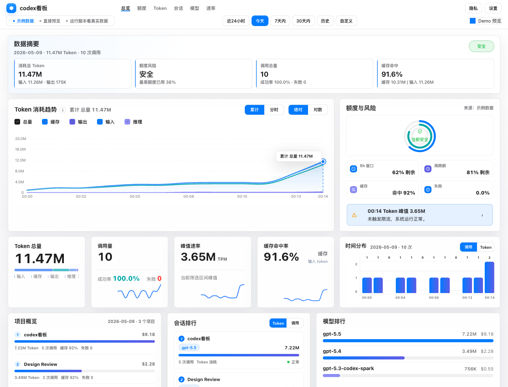

# codex看板

一个本地优先的 Codex 用量看板，用来查看 Token 消耗、额度风险、费用估算、模型占比、会话排行和体感速度。



> 截图使用示例数据。真实运行时，数据来自你本机的 Codex 会话日志，不会上传到服务器。

## 适合谁用

如果你经常使用 Codex，希望快速回答这些问题：

- 今天一共用了多少 Token？
- 哪个项目、会话或模型最耗？
- 当前有没有额度风险？
- 费用大概是多少？
- Codex 现在是“真慢”，还是只是某几个请求慢？

这个看板就是为这种本地自查场景准备的。

## 核心功能

- **数据摘要**：总 Token、调用次数、成功率、缓存命中和风险状态。
- **Token 趋势**：查看输入、输出、缓存、推理 token 的时间变化。
- **额度与风险**：展示 5h 窗口、周额度、失败率和风险提示。
- **费用统计**：按官方美元价估算，支持 CNY 展示换算。
- **速度判断**：用体感速度分、开始等待、慢请求和每分钟输出量判断当前速度。
- **排行分析**：项目、会话、模型排行，方便定位最耗的使用场景。
- **隐私模式**：一键隐藏项目名和会话名，适合截图或演示。
- **浅色/深色模式**：跟随 macOS 系统外观自动切换。

## 快速开始

先安装依赖：

```bash
npm install
```

启动本地服务：

```bash
npm start
```

然后打开：

```text
http://127.0.0.1:4174/index.html
```

macOS 用户也可以直接双击：

```text
start-codex-dashboard.command
```

## Release 包使用

如果你下载的是 GitHub Releases 里的 `codex看板-mac.zip`：

1. 解压 zip。
2. 双击 `Open codex看板.command`。
3. 如果 macOS 拦截，打开「系统设置 > 隐私与安全性」，点击「仍要打开」。
4. 浏览器会打开 `http://127.0.0.1:4174/index.html`。

Release 包同样会启动本地服务，并每 60 秒刷新一次数据。当前 Release 包需要本机已经安装 Node.js 18 或更高版本。

## 数据刷新

本地服务会每 60 秒重新读取一次 Codex 会话日志，并生成 `data.js`。

```bash
npm start
```

如果你想让服务占用当前终端，方便看日志，可以运行：

```bash
npm run serve
```

停止服务：

```bash
npm run stop
```

## 数据来源

默认读取本机目录：

```text
~/.codex/sessions
```

看板只提取用量相关元数据，例如：

- 时间
- 模型
- Token 数量
- 会话和项目名称
- 缓存命中
- 失败记录
- 额度窗口状态

## 隐私说明

codex看板是本地工具，不需要云端服务。下面这些文件可能包含你的真实本地使用信息，默认不会提交到 GitHub：

- `data.js`
- `.codexscope-cache.json`
- `.codexscope-server.log`
- `.codexscope-server.pid`
- `.env`

如果你要公开仓库，请再次确认这些文件没有被提交。

## 常用命令

```bash
npm start                 # 后台启动本地服务
npm run stop              # 停止本地服务
npm run serve             # 前台启动服务，适合调试
npm run generate          # 手动生成 data.js
npm run build:frontend    # 编译前端 TypeScript
```

## 项目结构

```text
index.html                         页面入口
app.ts / app.js                     看板逻辑
styles.css                         基础样式
styles-mac-console.css             macOS 风格定制层
scripts/generate-codex-data.mjs    本地数据生成脚本
scripts/serve-local.mjs            本地刷新服务
scripts/start-local.mjs            后台启动脚本
scripts/stop-local.mjs             停止服务脚本
data.sample.js                     示例数据
```

## 注意事项

- 直接打开 `index.html` 可以预览页面，但不会自动刷新真实数据。
- GitHub Pages 不能读取你本机的 Codex 日志，所以这个项目更适合本地运行。
- 费用是按公开价格和本地 token 记录估算，实际账单仍以官方为准。
- CNY 只是展示换算，原始估算币种是 USD。

## 来源

本项目基于 [JUk1-GH/CodexScope](https://github.com/JUk1-GH/CodexScope) 做本地二次改造，当前版本已经定制为 `codex看板`。
