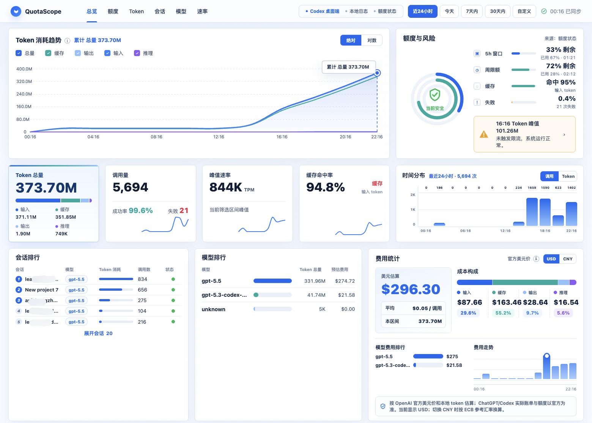

# CodexScope

[English](README.md) | 简体中文

[](https://linux.do)

CodexScope 是一个本地优先的 Codex 用量面板，用来查看你本机 Codex 会话日志里的 Token 消耗、额度状态、会话排行、模型排行、调用分布、缓存命中率和费用估算。



它是一个静态 HTML 页面：没有后端、没有账号接入、没有托管遥测。真实用量数据只会导出到本地的 `data.js`，并且这个文件默认不会提交到 git。

## 为什么做

Codex 的用量如果只看零散日志，很难判断 Token 花到哪里、哪个项目最耗、哪个模型占比最高、什么时候接近额度风险。CodexScope 的目标很窄：把本地 Codex 元数据整理成一个可以直接打开的桌面面板。

## 功能

- 累计 Token 趋势，支持绝对值和对数视图
- 日期筛选：近 24 小时、今天、7 天内、30 天内、历史总览、自定义区间
- 调用分布和 Token 消耗分布，用来观察峰值
- 从本地 `rate_limits` 事件读取 Codex 额度与风险状态
- 会话排行和模型排行，显示 Token 总量与调用次数
- 按官方公开美元价格表做费用估算，默认显示 USD，可切换 CNY
- 从 `~/.codex/sessions` 本地生成数据
- 桌面端优先的轻量静态前端

## 快速开始

下载项目后，直接用浏览器打开 `index.html`，会先看到内置示例数据。

如果要看自己的真实 Codex 用量，普通用户建议下载 GitHub Releases 里的平台包：

- **macOS**：下载 `CodexScope-mac.zip`，解压后双击根目录的 `Open CodexScope.command`
- **Windows**：下载 `CodexScope-windows.zip`，解压后双击根目录的 `Open CodexScope.cmd`

Release zip 会内置预编译生成器，普通用户不需要安装 Go。启动脚本会先在本地生成 `data.js`，然后打开 `index.html` 显示真实数据；源码 checkout 在没有预编译生成器时仍可回退到 `go build`。
后续运行会复用本地 `.codexscope-cache.json` 缓存，只重扫发生变化的会话日志，所以重复启动会快很多。

注意：GitHub 自动生成的 **Source code (zip)** 是源码包，不是普通用户推荐入口；它可能需要本机安装 Go 或自己编译。请优先下载上面的 `CodexScope-mac.zip` / `CodexScope-windows.zip`。

如果 macOS 提示无法验证 `open-dashboard.command`，打开 **系统设置 → 隐私与安全性**，找到被拦截的 `open-dashboard.command`，点击 **仍要打开**。也可以右键这个文件，选择“打开”。

如果还是打不开，在项目文件夹里打开终端，执行一次：

```bash
xattr -dr com.apple.quarantine .
chmod +x macos/open-dashboard.command
```

也可以手动运行：

macOS 或 Linux：

```bash
go run generate_codex_data.go
open index.html
```

Windows PowerShell：

```powershell
go run .\generate_codex_data.go
start .\index.html
```

默认读取的 Codex 日志目录：

- macOS/Linux：`~/.codex/sessions`
- Windows：`%USERPROFILE%\.codex\sessions`

如果你的 Codex 会话目录不在默认位置，可以手动指定：

```powershell
go run .\generate_codex_data.go --root "$env:USERPROFILE\.codex\sessions"
```

生成器会把真实数据写到 `index.html` 同目录下的 `data.js`。`data.js` 和 `.codexscope-cache.json` 都可能包含项目名、会话 id、时间戳、用量模式和额度状态，所以已经被 `.gitignore` 排除。

## 项目结构

- `index.html`：静态面板外壳。
- `styles.css`：面板布局和视觉样式。
- `app.ts`：图表、筛选、排行、额度状态和费用估算的 TypeScript 源码。
- `app.js`：由 TypeScript 编译出的浏览器脚本，`index.html` 会直接加载它。
- `generate_codex_data.go`：本地数据生成器，扫描 Codex JSONL 会话日志，提取用量元数据并写入 `data.js`。
- `data.sample.js`：内置示例数据。没有本地 `data.js` 时，页面会先显示这份数据。
- `CHANGELOG.md`：每个公开版本的更新记录。
- `macos/open-dashboard.command`：macOS 启动脚本，负责运行生成器并打开面板。
- `windows/open-dashboard.cmd`：Windows 启动脚本，负责运行生成器并打开面板。
- `verify_responsive.js`：基于 Playwright 的响应式布局和交互验证脚本。
- `scripts/build-release.sh`：构建分平台 release 目录和 zip 包。
- `assets/`：截图和静态项目资源。

## 数据流

1. Codex 把本机会话日志写到 `~/.codex/sessions`。
2. `generate_codex_data.go` 扫描本地 `.jsonl` 文件，只提取用量元数据：Token 数、模型名、会话 id、耗时、失败状态和 rate-limit 元数据。
3. 生成器把这些记录写入 `data.js`，暴露为 `window.CODEXSCOPE_DATA`。
4. `index.html` 会先加载 `data.sample.js`，再加载 `data.js`。如果真实本地数据存在，它会覆盖示例数据。
5. 日期筛选、趋势图、排行、额度状态和费用估算都在浏览器里基于这份本地记录计算。

## 页面里显示什么

- **Token 消耗趋势**：所选时间范围内输入、缓存、输出、推理 Token 的累计变化。
- **额度与风险**：如果本地日志里有 rate-limit 元数据，会显示短窗口额度、周额度、缓存命中和失败风险。
- **时间分布**：按时间桶统计调用次数或 Token 消耗。
- **排行**：当前区间内最活跃的会话和模型。
- **费用统计**：基于本地 Token 数量和内置模型价格表做估算。

## 费用估算说明

费用统计只是估算，不是官方账单。它使用本地 Token 数量和内置的 OpenAI 公开美元价格表计算。实际 ChatGPT/Codex 账单、余额、订阅额度和限制状态，请以官方账号或账单页面为准。

USD 是原始计算币种。CNY 只是展示换算。能联网时，CodexScope 会通过 Frankfurter API 获取 USD/CNY 汇率，并使用 ECB 数据源；如果请求失败，会回退到内置参考汇率，并在页面标记为离线回退。

## 验证布局

响应式视觉检查使用 Playwright：

```bash
npm install
npm run verify
```

## 构建 Release 包

Release 包会内置预编译生成器，普通用户不需要安装 Go：

```bash
npm install
npm run release:local
```

生成结果：

- `dist/CodexScope-mac.zip`：根目录只放启动入口和说明，其余文件收进 `CodexScope Files/`
- `dist/CodexScope-windows.zip`：根目录只放启动入口和说明，其余文件收进 `CodexScope Files/`

GitHub Actions 的 release workflow 会在 `v*` 标签上构建同样的 zip 文件。

## 隐私

CodexScope 不会把数据发送到服务器。`generate_codex_data.go` 只读取本地 Codex 会话日志，并导出以下用量元数据：

- 会话 id 和工作目录 basename
- 模型名
- Token 数量
- rate limit 元数据
- 任务耗时、首 Token 延迟、失败状态

它不会导出提示词、助手回复、工具输出或文件内容。

分享截图或导出的产物前，建议先检查自己的 `data.js`。

## License

MIT
